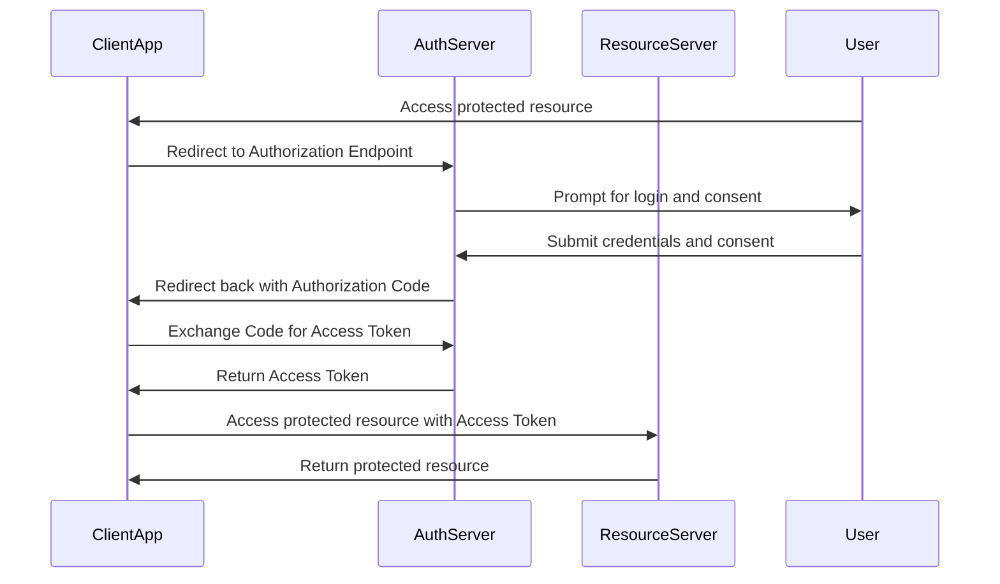

🎯 OAuth2 Playbook is a hands-on reference for engineers.

## OAuth2 Playbook

OAuth2 Playbook is a hands-on reference for engineers who need to understand and implement OAuth 2.0 in real systems. It’s organized as a collection of runnable samples, and best-practice patterns that bridge the gap between the spec and production-safe implementations.

## Why OAuth2 Playbook?

- OAuth2 is conceptually simple but easy to get wrong in practice. Small mistakes around token handling, client secrets, or redirect URIs quickly lead to
vulnerabilities or brittle integrations.
- This playbook translates spec language into actionable recipes: what to configure, what to check, and how to test flows end-to-end.

**[oauth2-playbook](https://github.com/challamani/oauth2-playbook)** repository.

## 📦 Repository Overview

The repository is organized by OAuth2 flows and supporting components:

- `authorization-code-flow/` — Browser-based user login using Authorization Code grant  
- `client-credentials-flow/` — Machine-to-machine authentication  
- `device-code-flow/` — OAuth for CLI tools and limited-input devices  
- `resource-server/` — Protected API validating access tokens  
- `best-practices/` — Security and implementation guidelines  

## 🔑 Authorization Code Flow + PKCE

The Authorization Code flow is the most widely used OAuth2 flow. It is designed for applications where a user logs in via a browser and explicitly grants consent, objective is to obtain an access token (time-bounded access token) to call protected APIs on behalf of the user.

### Flow Summary

1. Client redirects the user to the authorization server  
2. User authenticates and approves scopes  
3. Authorization server redirects back with a `code`  
4. Client exchanges the code for an access token  

This is exactly what the `authorization-code-flow/` directory demonstrates.

### Local Dev mode challenges with self-signed TLS certs

Lunch everything with TLS enabled is important because OAuth2 spec mandates secure communication channels for token exchanges.

When test the authorization code flow locally, you can launch the oauth2-provider, resource-server, and client app with self-signed TLS certs. The playbook includes scripts to generate these certs and configure the apps.

But the modern browsers won't accept self-signed certs, so you have explicitly trust them in your browser, otherwise your client app cannot pull the document descripters from the authorization server.

Also, when you launch the client app on a different port, e.g., `https://localhost:3000` (when you not launching the `client-app` as a static asset in resource-server in local dev), then you need to configure the `CORS` settings accordingly in resource-server, and set redirect URIs in the authorization server that is matching client app origin.


#### Resource Server CORS config

```java
  #CORS Settings
  quarkus.http.cors.origins=https://localhost:3000
  quarkus.http.cors.enabled=true
  quarkus.http.cors.methods=GET,POST,PUT,DELETE,OPTIONS
  quarkus.http.cors.headers=Authorization,Content-Type
  quarkus.http.cors.access-control-allow-credentials=true
  quarkus.http.cors.exposed-headers=Content-Disposition 
  quarkus.http.cors.access-control-max-age=24H
```

### Auth Config in Client App

```typescript
  import { UserManager, WebStorageStateStore } from "oidc-client-ts";
  export const userManager = new UserManager({
    authority: "https://localhost:9443/realms/oauth2-playbook",
    client_id: "oauth2-playbook-auth-code-pkce",
    redirect_uri: `${window.location.origin}/callback`,
    response_type: "code",
    scope: 'openid profile users:read',
    post_logout_redirect_uri: window.location.origin,
    automaticSilentRenew: true,
    filterProtocolClaims: true,
    loadUserInfo: true,
    userStore: new WebStorageStateStore({ store: window.sessionStorage })
  });
```

### Authorization Code flow with PKCE

In the playbook, `oidc-client-ts` library is used to handle the Authorization Code flow with PKCE in the client app. This library abstracts away the complexities of the OAuth2 flow and provides a simple API for managing user authentication.

### Sequence Diagram



## Device Code Flow — when to use

Devices with constrained input (TVs, game consoles, smart devices), where the user prefers to complete authentication on another device (phone/PC).
CLI and Headless apps where embedding a browser is impractical.
Scenarios requiring unattended pairing or long-lived human consent without exposing credentials on the device.

Examples:

- CLI tools (e.g., AWS CLI, Azure CLI)
- Smart TVs
- IoT devices (e.g., home assistants)

## Best Practices

### Token storage guidance

- SPA public clients: keep access tokens in memory, prefer short lifetimes, and use `Authorization Code + PKCE`. Don't store tokens in localStorage.
- Server-side apps: httpOnly, secure cookies (SameSite=Strict/Lax) with server-managed refresh.
- Machine-to-machine: store secrets securely (vault), use rotation and mTLS.

### JWT validation & introspection

- Validate signature, issuer (iss), audience (aud), expiry (exp), and scopes.
- Cache JWKs and handle key rotation; fall back to introspection for opaque tokens.

### Quick CORS + CSRF summary per flow

- Authorization Code + PKCE (SPA): CORS allowed for frontend origin + state + PKCE; avoid refresh tokens or rotate them via backend.
- Confidential server: Cookies with SameSite + CSRF middleware; no CORS unless API consumed cross-origin.
- Client Credentials: No CORS, secure client auth (mTLS/JWT), network-level access control.

### Additional Resources

- [OAuth 2.0 Security Best Current Practice](https://datatracker.ietf.org/doc/html/draft-ietf-oauth-security-topics)
- [OAuth2 Cheatsheet](https://cheatsheetseries.owasp.org/cheatsheets/OAuth2_Cheat_Sheet.html)
- [Udemy Course: The Nuts and Bolts of OAuth 2.0](https://www.udemy.com/course/oauth-2-simplified/?referralCode=B04F59AED67B8DA74FA7)
- [OpenID Connect Core 1.0](https://openid.net/specs/openid-connect-core-1_0.html)